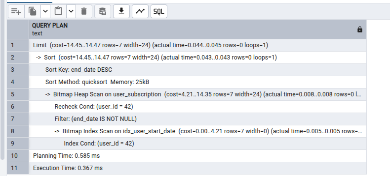
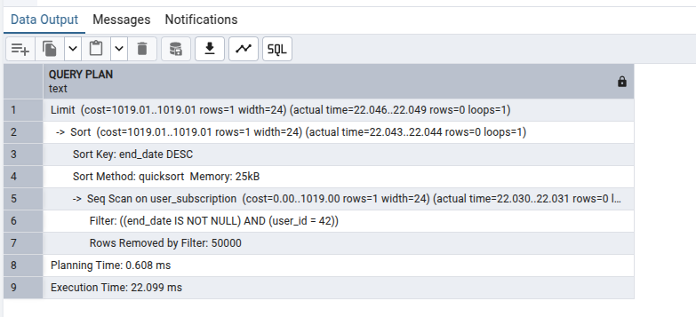

# Subscription API

A Flask-based RESTful API for managing user subscriptions with performance-focused database optimizations.

---

## 🚀 Getting Started

### 📦 Installation

```bash
git clone https://github.com/ha2709/subscription.git
cd subscription-api
python -m venv env
source env/bin/activate
pip install -r requirements.txt
```

### Optimization Highlights
- Raw SQL for performance-critical subscription queries (avoids ORM overhead).
- Indexed `user_id` and `is_active` to speed up lookups.
- `LIMIT 1` to reduce scanned rows.
- Batched inserts and updates in SQL (atomic ops).


`python main.py`

flask db init
flask db migrate
flask db upgrade
export PYTHONPATH=$(pwd)
export FLASK_APP=main.py
flask db migrate -m "Initial migration"

http://127.0.0.1:5000/api/auth/register

Body → raw → JSON:
 
{
  "email": "testuser@example.com",
  "password": "securepassword"
}


Database Optimization Strategy

SQLAlchemy Core used for performance-critical queries

Composite indexes created on columns used in WHERE and ORDER BY clauses

Avoided ORM .query.filter() when bulk read speed matters

Indexed filtered columns like end_date IS NOT NULL to enable fast access to historical data

pytest -v tests/
pytest -v tests/test_subscription.py

📊 Performance Example

Index: it takes 0.3 ms  

Without Index , it takes 22 ms 

Comparison of subscription query performance with and without proper indexing.